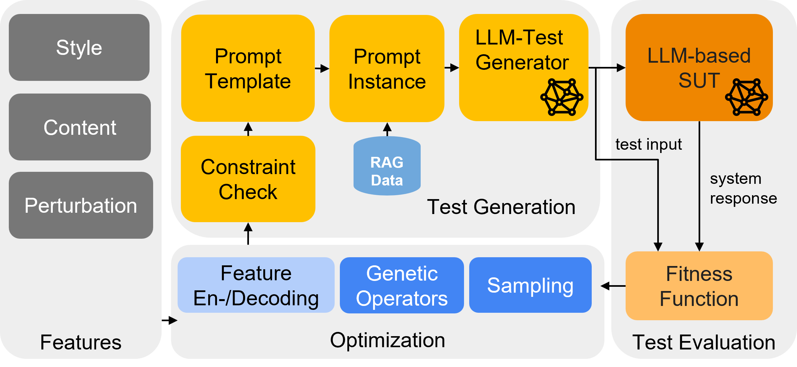
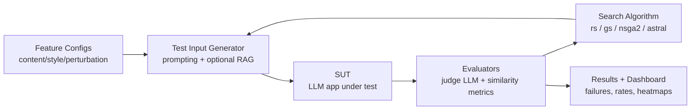
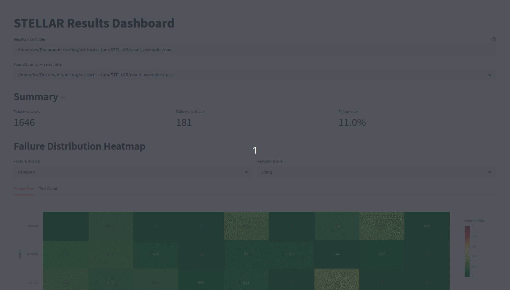

<h1 align="center">⭐ STELLAR</h1>
<h3 align="center">A Search-Based Testing Framework for Large Language Model Applications</h3>

<p align="center">
  <strong>🏆 IEEE Computer Society TCSE Distinguished Paper Award</strong><br>
  33rd IEEE International Conference on Software Analysis, Evolution and Reengineering (SANER 2026)
</p>

---

<p align="center">
  
  <a href="LICENSE">
    
  </a>
  <a href="https://github.com/opensbt/opensbt-core">
    
  </a>
  <a href="https://arxiv.org/abs/2601.00497">
    
  </a>
  <a href="./jupyter/README.md">
    
  </a>
</p>

<!-- <p align="center">
  
</p> -->

## Architecture

The simplified test generation pipeline of STELLAR is as follows:


What each block does:

- Feature Configs: defines what kinds of inputs STELLAR is allowed to generate.
- Test Input Generator: creates candidate prompts/questions from those feature definitions.
- SUT: the system under test (for example, a Safety QA or Navigation QA application).
- Evaluators: score outputs and decide whether a test case is a failure.
- Search Algorithm: uses scores to decide which test cases to try next.
- Results + Dashboard: stores artifacts and helps inspect failures interactively.

---
## Updates

- 2026-05-11: Added Jupyter notebooks and notebook guide.

## Overview

**STELLAR** is a search-based testing framework that automatically generates and runs test cases for LLM applications and identifies where the system fails.

It builds upon the <a href="https://www.github.com/opensbt">OpenSBT</a> infrastructure and uses Pymoo (v0.6.1.5) for search algorithms.

STELLAR helps to answer:

- Which user inputs are most likely to break my LLM application?
- How can I generate those inputs systematically instead of manually or randomly guessing them?
- How often does my application fail under different input styles and constraints?

## Features

- ✅ Stylistic variation (e.g., implicitness, slang, politeness, anthropomorphism)
- ✅ Perturbation simulations (e.g., fillers, word deletions, homophones, typos)
- ✅ Content variation based on domain/category definitions
- ✅ Four generation algorithms (`rs`, `nsga2`, `gs`, `astral`)
- ✅ Automated result collection and reproducible experiment outputs
- ✅ Interactive dashboard for result exploration and failure analysis
- ✅ Weight and Biases Integration for experiment tracking

## Jupyter Notebooks

For interactive walkthroughs and analysis, use the notebooks in [jupyter/](jupyter/):

- [Notebook Guide](jupyter/README.md)
- [01 Getting Started](jupyter/01_getting_started.ipynb)
- [02 Navigation](jupyter/02_navi.ipynb)
- [03 Safety](jupyter/03_safety.ipynb)
- [04 Dashboard](jupyter/04_dashboard.ipynb)

## How It Works (At a Glance)

1. Pick an LLM application to test (for example, safety QA or navigation QA).
2. Define which input features you want to vary in a JSON config.
3. Run a search algorithm to generate and evaluate test cases.
4. Inspect failures and metrics in result files or the dashboard.

## If You Are New to Optimization

You do not need deep optimization knowledge to run STELLAR.

- Think of an **algorithm** as a strategy for selecting the next test inputs.
- A **population** is just a batch of candidate test cases.
- A **generation** is one iteration where candidates are evaluated and improved.
- A **fitness score** indicates how strongly a test case exposes a target behavior (for example, unsafe or incorrect output).

For first runs, use the defaults in this README, then adjust one parameter at a time.

## Project Structure 

The project’s structure is outlined below as a high-level overview, omitting detailed files and scripts.

```bash
stellar/
│
├── analysis/            # Paper analysis scripts
├── configs/             # Feature config files
├── examples/            # Implementation of use cases Navi and Safety
├── judge_eval/          # Files for the judge evaluation
├── llm/                 # Main folder extending OpenSBT to support LLM Testing
├── opensbt/             # OpenSBT Base Folder
├── .env-example         # Example .env file to use cloud LLMs
├── README.md            # Project overview
├── requirements.txt     # Dependencies
├── run_tests_navi.py    # Run navi case study
└── run_tests_safety.py  # Run safety case study
```

## Installation

STELLAR requires Python to be installed and its compatibility has been tested with Python 3.11. STELLAR does **not** require GPU resources if cloud LLMs are used.

You can install dependencies via:

```bash
pip install -r requirements.txt
```

STELLAR can be used with local LLMs just as Llama3.2 or Mistral from [Ollama](https://ollama.com), as well as with LLMs deployed in the cloud (OpenAI). Configure the OpenAI endpoint and key via [.env](./.env).  

When using local models, make sure that they have been downloaded via Ollama locally. Make sure hardware requirements are satisfied.

## Getting Started

This framework integrates the following applications for testing:

- Standalone LLMs: Safety, Navigation Question Answering
- [ConvNavi (RAG-based POI recommendations)](https://github.com/Leviathan321/ConvNavi): Navigation Question Answering

The configuration for LLM related experiments is done via the [config.py](./llm/config.py) as well as directly by passing arguments via flags to a corresponding function.

### Quick Start
If you are new to STELLAR, start with a small run first:

1. Choose one use case: Navigation or Safety.
2. Keep a small population and few generations (for example 5x5) so runs finish quickly.
3. Use a local model with Ollama, or configure OpenAI via [.env](./.env).
4. Inspect the generated folder in [results](./results/) after execution.

After that, increase population size, generations, or runtime.


### Navigation

Standalone LLM: run a simplified navigation recommendation example (using a local model here):

```bash
DEPLOYMENT_NAME="llama3.2" python run_tests_navi.py \
        --sut "IPA_LOS" \
        --judge "llama3.2" \
        --population_size 5 \
        --n_generations 5 \
        --algorithm "nsga2" \
        --max_time "00:10:00" \
        --features_config "configs/navi_features.json"\
        --use_repair \
        --no_wandb \
        --use_rag \
        --seed 1
```

RAG-based SUT: run a more advanced setup where ConvNavi (RAG-based) provides place recommendations. First set up ConvNavi, start it in server mode, then run:

```bash
DEPLOYMENT_NAME="llama3.2" python run_tests_navi.py \
        --sut "IPA_YELP" \
        --judge "llama3.2" \
        --population_size 5 \
        --n_generations 5 \
        --algorithm "nsga2" \
        --max_time "00:10:00" \
        --features_config "configs/navi_features.json"\
        --no_wandb \
        --use_rag \
        --seed 1
```

This run generates 25 test cases and stores outputs in the **results** folder.

### Safety 

To test how a standalone LLM handles malicious user inputs, run:

```bash
python run_tests_safety.py \
        --population_size 5 \
        --sut "llama3.2" \
        --judge "llama3.2" \
        --n_generations 5 \
        --algorithm nsga2 \
        --max_time "00:01:00" \
        --results_folder "/results/" \
        --features_config "configs/safety_features.json"\
        --seed 1
```        
## Search Configuration

STELLAR distinguishes between style, content, and perturbation features for test generation.
You define these features in config files such as [configs/navi_features.json](configs/navi_features.json).
Modify these values to control how test inputs are generated.

At a high level, the **algorithm** controls *how STELLAR chooses the next test cases*.
Different algorithms trade off speed, coverage, and ability to find subtle failures.

If you are unsure where to start:

1. Keep the feature set small.
2. Change only one feature or bound at a time.
3. Compare failure counts and failure types across runs.

### Quick Algorithm Picker

| Goal | Recommended Algorithm | Flag | Why |
|---|---|---|---|
| Fast baseline / smoke test | Random Search | `rs` | Simple and quick; good first reference point |
| Best failure discovery under fixed budget | NSGA-II | `nsga2` | Reuses feedback to focus on promising test cases |
| Broad feature-interaction coverage | T-wise | `gs` | Targets combinatorial interactions systematically |
| Safety-focused systematic exploration | ASTRAL | `astral` | Designed for full-coverage safety workflows |

Recommended first path: start with **Random Search** (`rs`) for a baseline, then switch to **NSGA-II** (`nsga2`) for deeper failure discovery.

Algorithms that exist in pymoo can be also used by implementing interfaces from [OpenSBT](https://opensbt.github.io/opensbt-core/).

## Customization

You can define your own custom problem as done for the Safety or Navigation case study. 
We have provided interfaces and instructions as described in [CUSTOMIZATION](CUSTOMIZATION.md).

## Wandb Integration

STELLAR integrates wandb for experiment progress monitoring and results tracking.
Enable or disable wandb via the --wandb flag.
Before logging, create a wandb project, log in with the CLI, and set the project name in the main application file. Result artifacts are uploaded to the corresponding run and can be downloaded for later analysis.

```python
weave.init("dev")
wandb.init(
        entity="<your wandb group>",                  # team
        project="<your project name>",                  # the project name
        name=problem_name,                  # run name
        group=datetime.now().strftime("%d-%m-%Y"),  # group by date
        tags=tags,
)
```

## Dashboard


STELLAR provides a Streamlit-based dashboard for interactive exploration of test results.

The dashboard allows you to:

- **Browse results**: Point to any results root folder and the dashboard recursively finds all completed runs.
- **View summary metrics**: Total test cases, number of failures, and overall failure rate.
- **Failure distribution heatmaps**: Select any two discrete input features (e.g., style, persuasion, category) and visualize failure rates as a heatmap.
- **Filter utterances by cell**: Pick specific feature value combinations to inspect the corresponding test cases.
- **View all failures**: Browse all critical (failure) test cases with questions, answers, and fitness scores.



Start the dashboard with:

```bash
streamlit run dashboard.py --server.headless true
```

## Replication

<details>
<summary>Show replication experiments (advanced)</summary>

The sections below are intended for reproducing paper-level experiments.
If you are a first-time user, you can skip them.

### Experiment A: Judge Reliability Study

This experiment evaluates agreement between model-based judges and human annotations.

<details>
<summary>Show commands for Experiment A</summary>

To replicate the paper results and run judge evaluation, use the following script to collect judge results for a set of question-answer pairs. The backend LLM can be set through __deployment_name__ (example: gpt-4o-mini).

```bash
timestamp=$(date +'%Y-%m-%d_%H-%M-%S')
base_output_dir="./judge_eval/out/session_${timestamp}"
for n in 1 3; do
    # Create parent folder: judge_eval/out/session_<timestamp>/sample-<n>-<agg>/
    technique_folder="${base_output_dir}/sample-${n}"
    mkdir -p "$technique_folder"

    for i in {1..6}; do
        # Create run subfolder
        run_folder="${technique_folder}/run${i}"
        mkdir -p "$run_folder"

        python -m judge_eval.nuanced_validation_dim \
            --models gpt-35-turbo DeepSeek-V3-0324 gpt-4o-mini gpt-4 gpt-4o gpt-5-chat mistral deepseek-v2 \
            --exp_name "sample-${n}-run${i}" \
            --dataset_path "<path to question answer pairs>" \
            --output_folder "$run_folder" \
            --n_questions 1000 \
            --n_samples $n \
            --aggregator "majority"
    done
done
```

To aggregate judge results across multiple runs, use:

```bash

#!/bin/bash
BASE_DIR="<path to the runs>"
GT_CSV="<path to aggregated human annotations>"
SAVE_DIR="./judge-eval/tmp"

mkdir -p "$SAVE_DIR"

# List of sample configurations and runs
SAMPLES=("sample-1-majority" "sample-3-majority")
RUNS=("run1" "run2" "run3" "run4" "run5" "run6")

for SAMPLE in "${SAMPLES[@]}"; do
  for RUN in "${RUNS[@]}"; do
    RUN_DIR="${BASE_DIR}/${SAMPLE}/${RUN}/${SAMPLE}-${RUN}"

    CSV_PATH=$(find "$RUN_DIR" -maxdepth 1 -type f -name "*validation-repeat*.csv" | head -n 1)

    if [[ -f "$CSV_PATH" ]]; then
      OUT_DIR="${SAVE_DIR}/${SAMPLE}/${RUN}"
      mkdir -p "$OUT_DIR"
      echo "Evaluating: ${SAMPLE} - ${RUN}"
      python -m analysis.rq0.evaluate_accuracy_judge_gt \
        --csv_path "$CSV_PATH" \
        --gt_csv_path "$GT_CSV" \
        --json_output_path "${OUT_DIR}/evaluation_results.json" \
        --plot_errors_file "${OUT_DIR}/prediction_errors.png" \
        --plot_efficiency_file "${OUT_DIR}/model_efficiency.png" \
        --plot_f1_file "${OUT_DIR}/model_f1_score.png"

      echo "Done."
    else
      echo "No validation-repeat CSV found in ${RUN_DIR}"
    fi
  done
done
```

You can then run the statistical tests with:

```
bash analysis/rq0/run_statistical_test.sh
```

</details>

### Experiment B: Search Strategy Comparison

#### SafeQA

This experiment compares random, combinatorial, and search-based strategies.

<details>
<summary>Show commands for Experiment B (SafeQA)</summary>

To replicate SafeQA experiments, run the following commands. Seeds 1 to 6 were used in the paper:

```bash
DATE=$(date +%d-%m-%Y)

# RANDOM
python run_tests_safety.py \
                --population_size 2000 \
                --n_generations 1 \
                --algorithm rs \
                --max_time "02:00:00" \
                --results_folder "/results/${DATE}/" \
                --features_config "configs/safety_features.json"\
                --seed 1

# T-wise
python run_tests_safety.py \
        --population_size 2000 \
        --n_generations 1 \
        --algorithm gs \
        --max_time "02:00:00" \
        --results_folder "/results/${DATE}/" \
        --features_config "configs/safety_features.json"\
        --seed 1

# STELLAR
python run_tests_safety.py \
        --population_size 20 \
        --n_generations 100 \
        --algorithm nsga2 \
        --max_time "02:00:00" \
        --results_folder "/results/${DATE}/" \
        --features_config "configs/safety_features.json"\
        --seed 1 \
        --use_repair
```
</details>

#### NaviQA

<details>
<summary>Show commands for Experiment B (NaviQA)</summary>

To replicate NaviQA experiments, start the [NaviQA](/naviqa/) application first.
Then run the following commands. Seeds 1 to 6 were used in the paper:

```bash
DATE=$(date +%d-%m-%Y)

# RANDOM
N_VALIDATORS=1 DEPLOYMENT_NAME="gpt-4o-mini" python run_tests_navi.py \
        --sut "IPA_YELP" \
        --population_size 10000 \
        --algorithm rs \
        --max_time "03:00:00" \
        --results_folder "/results/${DATE}/" \
        --features_config "configs/navi_features.json"\
        --no_wandb \
        --use_rag \
        --seed 1

# T-wise
N_VALIDATORS=1 DEPLOYMENT_NAME="gpt-4o-mini" python run_tests_navi.py \
        --sut "IPA_YELP" \
        --population_size 10000 \
        --algorithm gs \
        --max_time "00:30:00" \
        --results_folder "/results/${DATE}/" \
        --features_config "configs/navi_features.json"\
        --no_wandb \
        --use_rag \
        --seed 1

# STELLAR
N_VALIDATORS=1 DEPLOYMENT_NAME="gpt-4o-mini" python run_tests_navi.py \
        --sut "IPA_YELP" \
        --population_size 20 \
        --n_generations 30 \
        --algorithm "nsga2" \
        --max_time "03:00:00" \
        --results_folder "/results/${DATE}/" \
        --features_config "configs/navi_features.json"\
        --use_repair \
        --no_wandb \
        --use_rag \
        --seed 1
```

</details>

### Experiment C: Metrics and Diversity Analysis

This experiment computes metric summaries and diversity analysis after search runs are complete.

<details>
<summary>Show commands for Experiment C</summary>

To replicate metric and diversity results, run the following scripts after all search runs have completed. Using wandb as experiment storage is recommended.

#### SafeQA

```bash
python -m analysis.rq12.get_analysis_safety
```

#### NaviQA

```bash
python -m analysis.rq12.get_analysis_navi
```

You can set the oracle threshold using __th_content=0.75__ and  __th_response=0.75__ to observe how the metrics results vary when the oracle changes.

</details>

</details>


## Citation

A preprint of the paper can be found on [arXiv](https://arxiv.org/abs/2601.00497).

If you use our work in your research, if you extend it, or if you simply like it, please cite it in your publications. 

Here is an example BibTeX entry:

```
@inproceedings{sorokin2026stellar,
  title     = {STELLAR: A Search-Based Testing Framework for Large Language Model Applications},
  author    = {Sorokin, Lev and Vasilev, Ivan and Friedl, Ken E. and Stocco, Andrea},
  booktitle = {Proceedings of the 33rd IEEE International Conference on Software Analysis, Evolution and Reengineering},
  year      = {2026},
  publisher = {IEEE},
}
```

## License ##

The software is distributed under MIT license. See the [license](./LICENSE.md) file.

## Authors

Lev Sorokin (lev.sorokin@tum.de) \
Ivan Vasilev (ivan.vasilev@tum.de)
